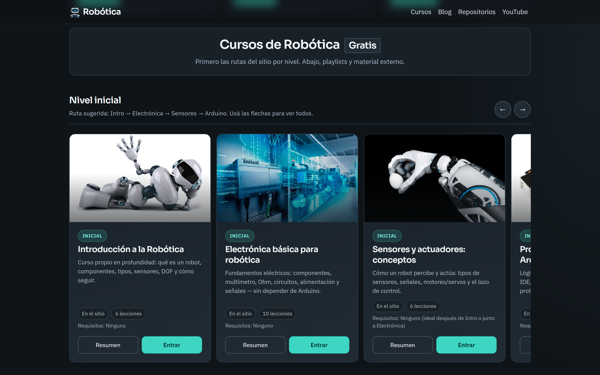
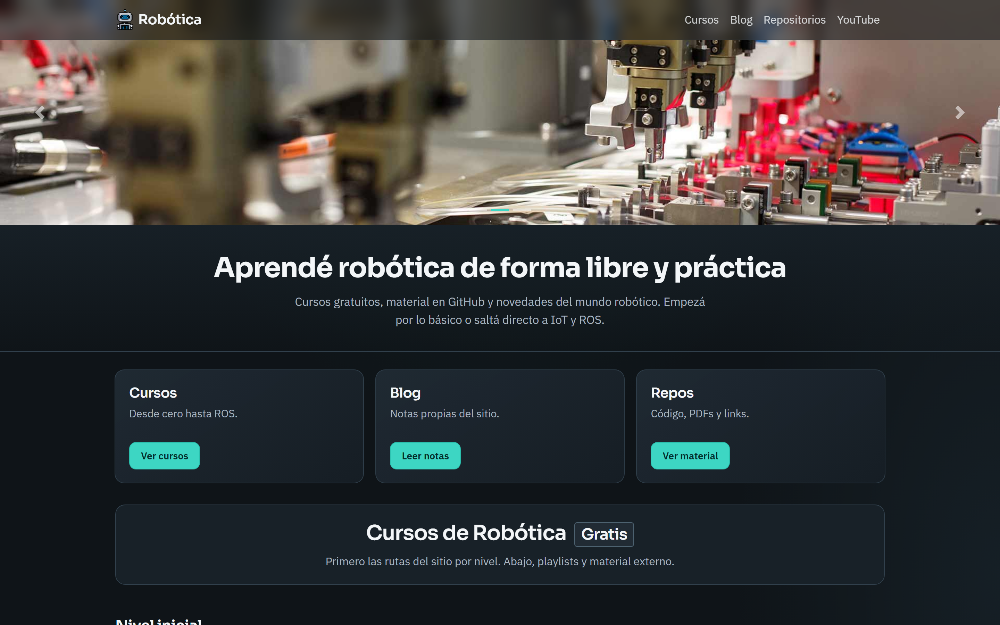
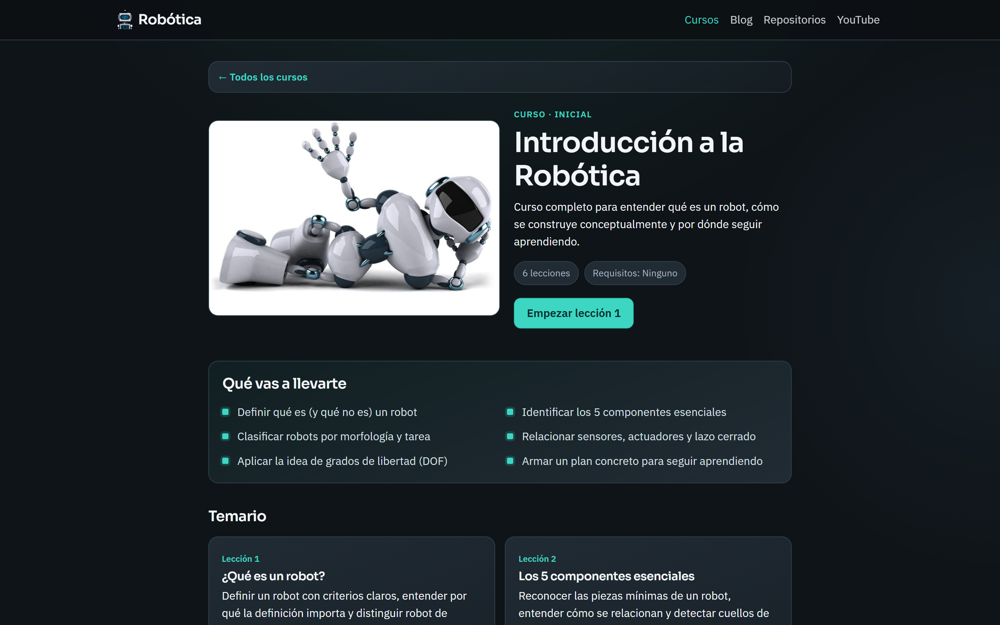
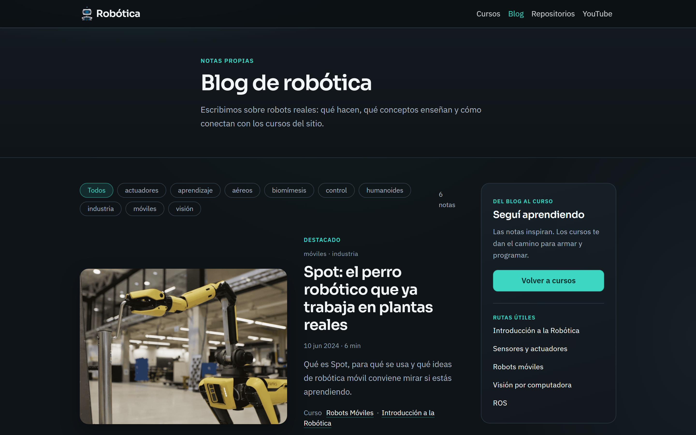
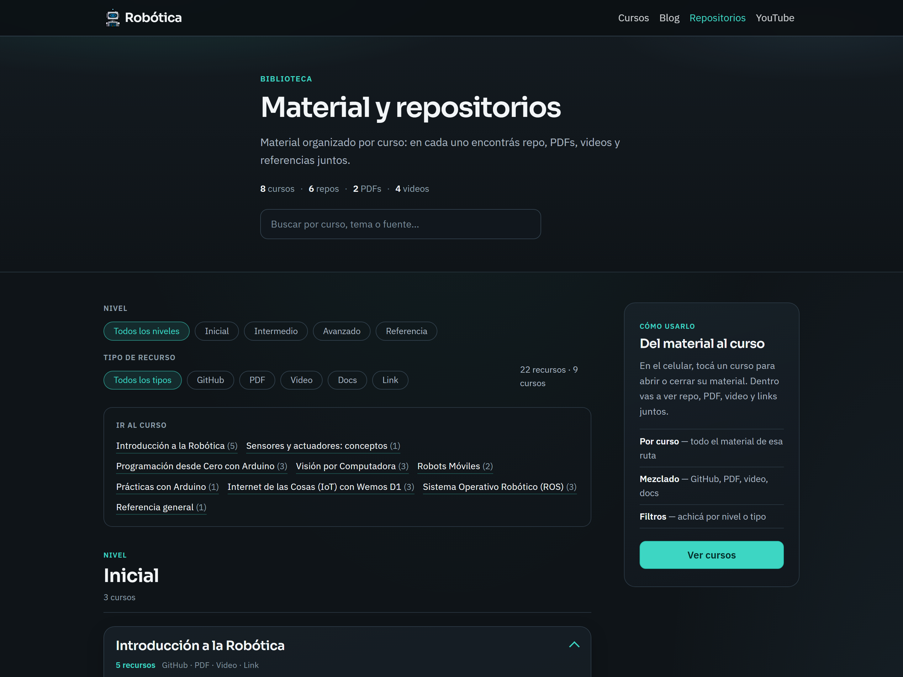
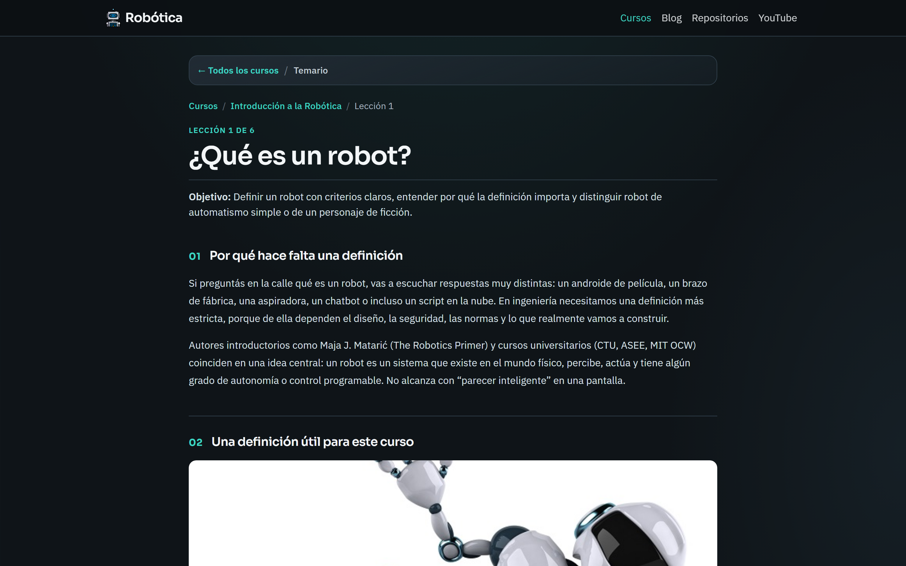

<div align="center">

<div align="right">


</div>
</div>

<br>

<br>

<div align="right">
  <a href="../../../README.md" title="Spanish">
    
  </a>
  <a href="./README.en.md" title="English">
    
  </a>
</div>

<div align="center">

# Robótica — Educational Robotics Website 

</div>

Educational website to **learn robotics** step by step: free courses by level (Inicial, Intermedio, Avanzado), an editorial blog with original notes, and a material hub with GitHub repos, PDFs, videos, and docs — all in a responsive UI ready for desktop and mobile.

* [**Website**](https://educational-robotics-website.vercel.app/) <a href="https://educational-robotics-website.vercel.app/" target="_blank" rel="noopener noreferrer" title="Live"></a>

<br>

## Index 📜

<details>
  <summary>View details</summary>

<br>

<div align="right">

`Last update: 31/08/26`

</div>

### Section 1) Description, configuration and technologies

* [1.0) Description.](#10-description-)
* [1.1) Project execution.](#11-project-execution-)
* [1.2) Project structure.](#12-project-structure-)
* [1.3) Technologies.](#13-technologies-)
* [1.4) Screenshots.](#14-screenshots-)

### Section 2) Usage flow and behavior

* [2.0) Site flow.](#20-site-flow-)
* [2.1) Courses and levels.](#21-courses-and-levels-)
* [2.2) Blog and resources.](#22-blog-and-resources-)
* [2.3) Data and partials.](#23-data-and-partials-)

### Section 3) Testing, deploy and references

* [3.0) Functional test.](#30-functional-test-)
* [3.1) Vercel deploy.](#31-vercel-deploy-)
* [3.2) Contributing.](#32-contributing-)
* [3.3) License.](#33-license-)

</details>

<br>

## Section 1) Description, configuration and technologies

### 1.0) Description [🔝](#index-)

<details>
  <summary>View details</summary>

<br>

**Robótica** is an educational multi-page website built with HTML, CSS, JavaScript, and Bootstrap 4. It helps beginners get started in robotics and also supports people who already know some basics and want to organize concepts before moving into hardware, Arduino, IoT, vision, or ROS.

The idea is a single place to study: pick a level, follow a course with theory and practice, read blog notes that expand on the topics, and open related material (repos, PDFs, videos, docs) without jumping between unrelated sites.

The project includes:

* **Home:** hero carousel, explore cards (Courses / Blog / Repos), and course carousels by level (Inicial, Intermedio, Avanzado, Próximamente).

* **Courses:** internal hubs with lesson content from JSON (`assets/data/courses/`), theory sections, practices, and related links so each path can be completed at your own pace.

* **Blog:** first-party editorial notes (not only outbound links), filters by tag, and post pages with video + related courses.

* **Material & repositories:** resources grouped by **course** (GitHub, PDF, video, docs, links), with search and filters by level/type.

* **Shared chrome:** navbar and footer loaded via `include.js`, with path rewriting through `Site.url()` for nested pages.

**Requirements:**

* [VS Code](https://code.visualstudio.com/) (or compatible) with the **Live Server** extension — recommended for local runs.
* Or any static HTTP server (Node.js `npx serve`, Python, etc.).
* Modern browser (Chrome, Firefox, Edge, Safari).

</details>

### 1.1) Project execution [🔝](#index-)

<details>
  <summary>View details</summary>

<br>

* Clone the repository (if you have not yet) and open the site folder in VS Code:

```bash
git clone https://github.com/andresWeitzel/robotic-website.git
cd robotic-website
```

> If this repo lives under another name locally, use the folder that contains `index.html` and `assets/`.

* Install **Live Server** in VS Code:
  1. Open the Extensions panel (`Ctrl+Shift+X` / `Cmd+Shift+X`).
  2. Search for **Live Server** (Ritwick Dey) and install it.

* Run the site with Live Server:
  1. In the Explorer, locate `index.html` at the project root.
  2. **Right-click** `index.html` → **Open with Live Server**.
  3. The browser opens (usually `http://127.0.0.1:5500`). Edits reload automatically.

* Alternative — Node.js `serve`:

```bash
npx serve .
```

Open the URL shown in the terminal (often `http://localhost:3000`).

* Alternative — Python:

```bash
python -m http.server 5500
```

Then open `http://localhost:5500`.

* `Important:` opening `index.html` via `file://` may break `fetch` for JSON/partials. Always use Live Server or another local HTTP server.

</details>

### 1.2) Project structure [🔝](#index-)

<details>
  <summary>View details</summary>

<br>

```
robotic-website/
├── index.html                     # Home
├── pages/
│   ├── blog.html                  # Blog listing
│   ├── blog/
│   │   └── nota.html              # Single post (?id=)
│   ├── repositorios.html          # Material hub
│   └── cursos/                    # Course hubs + lessons
│       ├── introduccion-robotica/
│       ├── electronica-basica/
│       ├── sensores-actuadores/
│       ├── arduino/
│       ├── practicas-arduino/
│       ├── robots-moviles/
│       ├── vision-por-computadora/
│       ├── iot-wemos/
│       └── ros/
├── components/
│   ├── navbar.html
│   └── footer.html
├── assets/
│   ├── css/                       # base, home, blog, repositorios, courses…
│   ├── js/                        # site, include, courses, blog, lessons…
│   ├── data/
│   │   ├── courses.json           # Catalog for home carousels
│   │   ├── blog.json              # Blog posts (body sections)
│   │   ├── resources.json         # Material hub items
│   │   └── courses/               # Per-course lesson JSON
│   └── img/                       # Brand, carousel, courses, blog, lessons
├── doc/
│   └── assets/                    # Icons, translation and README screenshots
│       ├── icons/
│       ├── repository/            # README screenshots (see 1.4)
│       │   ├── 01-cover-inicio.png    # Home hero
│       │   ├── 02-inicio-cursos.png   # README cover (Nivel inicial courses)
│       │   ├── 03-curso-hub.png
│       │   ├── 04-blog.png
│       │   ├── 05-repositorios.png
│       │   └── 06-leccion.png
│       ├── social-networks/
│       └── translation/           # README.en.md, AR / US flags
└── README.md
```

</details>

### 1.3) Technologies [🔝](#index-)

<details>
  <summary>View details</summary>

<br>

| **Technology** | **Version** | **Purpose** |
| ------------- | ------------- | ------------- |
| [HTML5](https://developer.mozilla.org/docs/Web/HTML) | 5 | Page structure (MPA) |
| [CSS3](https://developer.mozilla.org/docs/Web/CSS) | 3 | Design system (tokens, layout, pages) |
| [JavaScript](https://developer.mozilla.org/docs/Web/JavaScript) | ES5+/vanilla | Catalog, blog, resources, courses |
| [Bootstrap](https://getbootstrap.com/) | 4.5.x | Grid, navbar collapse, modals |
| [jQuery](https://jquery.com/) | 3.5.x (slim) | Bootstrap 4 JS dependency |
| [Git](https://git-scm.com/) | 2.x | Version control |
| [Vercel](https://vercel.com/) | — | Static hosting |
| [VS Code](https://code.visualstudio.com/) | — | Editor |

**Official documentation (stack):**

* Bootstrap: https://getbootstrap.com/
* MDN HTML: https://developer.mozilla.org/docs/Web/HTML
* MDN CSS: https://developer.mozilla.org/docs/Web/CSS
* MDN JS: https://developer.mozilla.org/docs/Web/JavaScript
* Vercel: https://vercel.com/docs
* GitHub Pages (optional mirror): https://docs.github.com/pages

</details>

### 1.4) Screenshots [🔝](#index-)

<details>
  <summary>View details</summary>

<br>

Desktop captures at **100%** zoom. They live in `doc/assets/repository/`. **`02-inicio-cursos.png`** is also this README's banner. Use them as the visual source for later repository annexes.

| File | What it shows |
|------|----------------|
| `01-cover-inicio.png` | **Home (hero).** Carousel, *Aprendé robótica de forma libre y práctica*, and Cursos / Blog / Repos cards. |
| `02-inicio-cursos.png` | **Home — courses.** *Cursos de Robótica* with the **Nivel inicial** carousel (Intro, Electrónica, Sensores, Arduino). |
| `03-curso-hub.png` | **Course hub.** *Introducción a la Robótica*: overview, outcomes and syllabus. |
| `04-blog.png` | **Blog.** Topic filters, featured note and course routes. |
| `05-repositorios.png` | **Material.** Search, level/type filters and resources grouped by course. |
| `06-leccion.png` | **Lesson.** Lesson 1 of the intro course (*¿Qué es un robot?*). |

<p align="center"></p>

<p align="center"><em>01 — Home cover</em></p>

<p align="center"></p>

<p align="center"><em>02 — Courses (Nivel inicial)</em></p>

<p align="center"></p>

<p align="center"><em>03 — Course hub</em></p>

<p align="center"></p>

<p align="center"><em>04 — Blog</em></p>

<p align="center"></p>

<p align="center"><em>05 — Material and repositories</em></p>

<p align="center"></p>

<p align="center"><em>06 — Lesson</em></p>

</details>

<br>

## Section 2) Usage flow and behavior

### 2.0) Site flow [🔝](#index-)

<details>
  <summary>View details</summary>

<br>

1. **Home:** user lands on the hero, explores Courses / Blog / Repos, then scrolls to course carousels by level.

2. **Course hub:** opens an internal course (`pages/cursos/...`), reads the overview, and enters lessons.

3. **Lesson:** course lesson scripts load JSON content (sections, exercises, related links).

4. **Blog:** list → filter by tag → open note (`nota.html?id=`) with original text, optional video, and course links.

5. **Material:** browse by level/course accordion; open GitHub, PDF, playlist, or docs; jump to the matching course.

</details>

### 2.1) Courses and levels [🔝](#index-)

<details>
  <summary>View details</summary>

<br>

Catalog source: `assets/data/courses.json`.

| Level | Examples |
|------|----------|
| Inicial | Introducción a la Robótica, Electrónica básica, Sensores y actuadores, Arduino |
| Intermedio | Prácticas Arduino, Robots móviles, Visión, IoT Wemos |
| Avanzado | ROS |
| Próximamente | SLAM / navegación, Raspberry Pi |

Each published course can expose:

* `internalPath` → hub on this site
* `overview` → summary modal on home
* Lesson JSON under `assets/data/courses/{id}.json`

</details>

### 2.2) Blog and resources [🔝](#index-)

<details>
  <summary>View details</summary>

<br>

**Blog** (`assets/data/blog.json`):

* Fields: `title`, `summary`, `lead`, `sections[]`, `tags`, `relatedCourseIds`, `videoId`, `articleUrl` (external source).
* Reading page: `/pages/blog/nota.html?id={postId}`.

**Resources** (`assets/data/resources.json`):

* Types: `github`, `pdf`, `video`, `docs`, `link`.
* Grouped on the page by **course** (and level bands), not as one infinite flat list.
* Filters: level + type + search.

</details>

### 2.3) Data and partials [🔝](#index-)

<details>
  <summary>View details</summary>

<br>

* `assets/js/site.js` → `Site.getBase()` / `Site.url()` for correct paths under `/pages/...`.
* `assets/js/include.js` → injects `components/navbar.html` and `footer.html`, marks active nav, improves mobile menu behavior.
* JSON is loaded with `fetch`; keep a static server in local development.

</details>

<br>

## Section 3) Testing, deploy and references

### 3.0) Functional test [🔝](#index-)

<details>
  <summary>View details</summary>

<br>

#### 3.0.1) Local server

Recommended: right-click `index.html` → **Open with Live Server**.

Or:

```bash
npx serve .
```

Check:

* Home loads carousel + course groups.
* Navbar: logo (home), Cursos, Blog, Repositorios, YouTube.
* Mobile menu opens/closes (X icon, overlay, Escape).

#### 3.0.2) Case 1 — Course

1. Open an Inicial course (e.g. Introducción).
2. Enter a lesson and confirm sections render from JSON.
3. Use back/nav to return to the hub and home `#cursos`.

#### 3.0.3) Case 2 — Blog

1. Open `/pages/blog.html`.
2. Filter by a tag and open **Leer nota**.
3. Confirm internal article text, video block, and related courses.

#### 3.0.4) Case 3 — Material

1. Open `/pages/repositorios.html`.
2. Expand a course accordion; open a GitHub item and a PDF.
3. Filter by type (e.g. Video) and search by course name.

#### 3.0.5) Nested paths

From `pages/cursos/.../leccion.html`, confirm navbar/footer links and image/JSON URLs resolve (no broken `fetch`).

</details>

### 3.1) Vercel deploy [🔝](#index-)

<details>
  <summary>View details</summary>

<br>

Typical publish path on Vercel:

1. Import the repository in [Vercel](https://vercel.com/).
2. Framework preset: **Other** (no build step required if you publish the site root as-is).
3. Root / output directory: the folder that contains `index.html` (e.g. `robotic-website` or repo root).
4. Deploy and verify:

* https://educational-robotics-website.vercel.app/
* `/pages/blog.html`
* `/pages/repositorios.html`
* at least one course hub under `/pages/cursos/`

**Published site:** [educational-robotics-website.vercel.app](https://educational-robotics-website.vercel.app/)

</details>

### 3.2) Contributing [🔝](#index-)

<details>
  <summary>View details</summary>

<br>

1. Fork the project.

2. Create a branch (`git checkout -b feature/my-improvement`).

3. Commit your changes (`git commit -m 'feat: short description'`).

4. Push to the branch (`git push origin feature/my-improvement`).

5. Open a Pull Request.

To add content without large code changes:

* New blog note → entry in `assets/data/blog.json`.
* New material item → entry in `assets/data/resources.json` with `courseId`.
* Course catalog tweaks → `assets/data/courses.json` + matching lesson JSON if needed.

</details>

### 3.3) License [🔝](#index-)

<details>
  <summary>View details</summary>

<br>

Open source educational project. Developed by [Andrés Weitzel](https://github.com/andresWeitzel).

**Related links:**

* **Live site:** [educational-robotics-website.vercel.app](https://educational-robotics-website.vercel.app/)
* **Screenshots:** [doc/assets/repository/](../repository/)
* **README (ES):** [../../../README.md](../../../README.md)
* **Study material (repo):** [github.com/andresWeitzel/Material_de_Estudio](https://github.com/andresWeitzel/Material_de_Estudio)
* **YouTube channel:** [youtube.com/@andresWeitzel](https://www.youtube.com/channel/UCuSVXmBcMURyTvbmbcgZalQ/featured)

</details>
