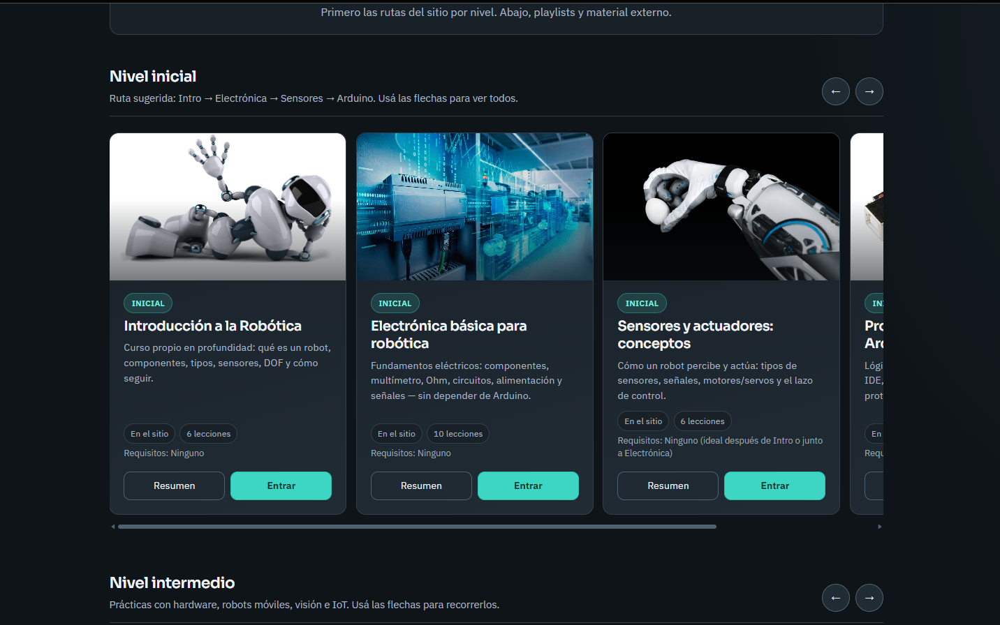
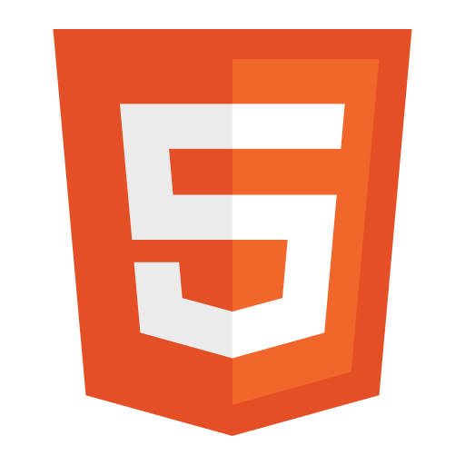
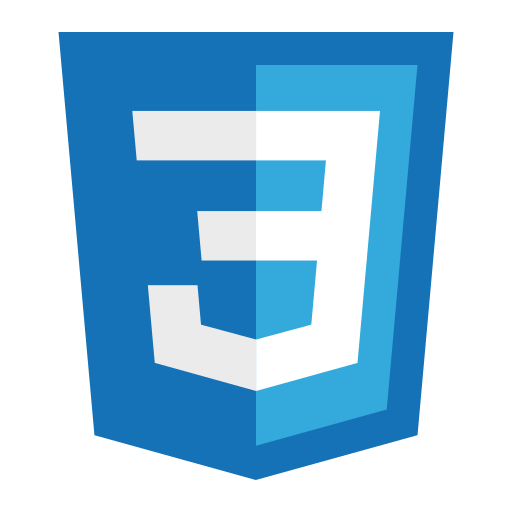
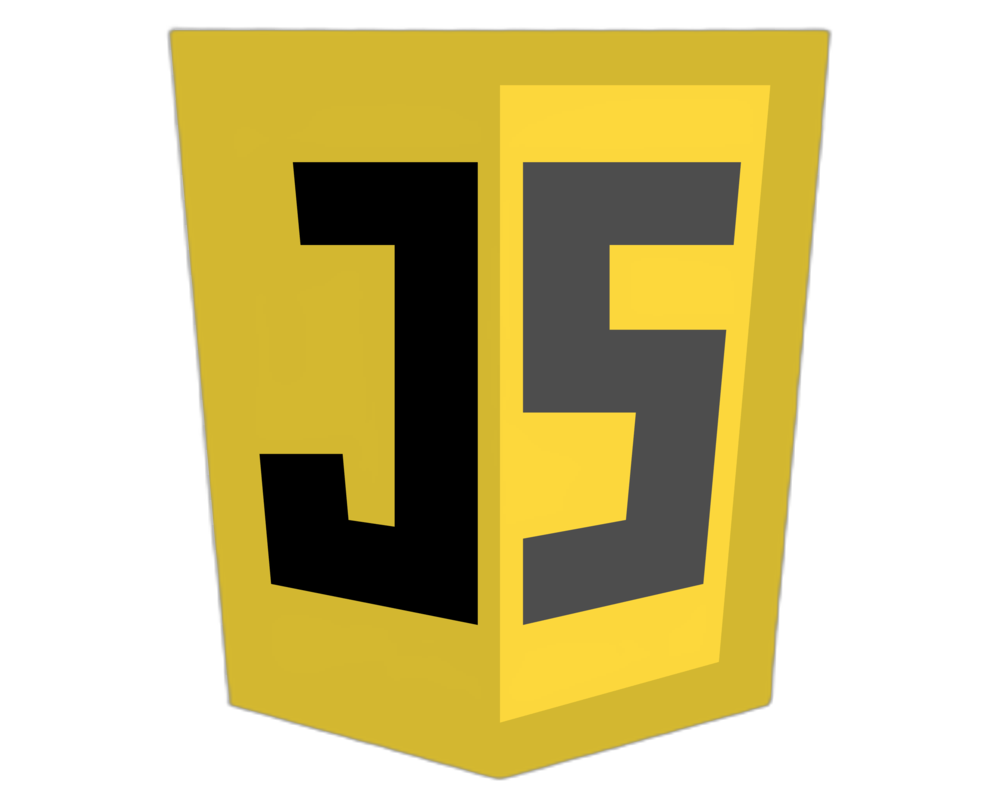
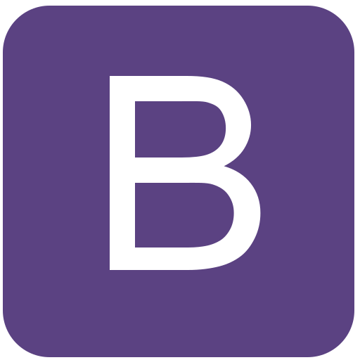
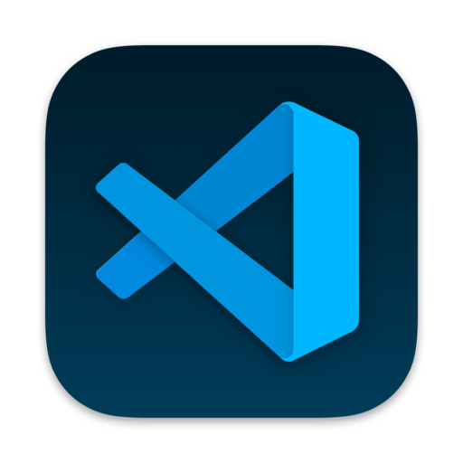

<div align="center">
  
</div>

<div align="right">
  
  &nbsp;
  
  &nbsp;
  
  &nbsp;
  
  &nbsp;
  
  &nbsp;
  
  &nbsp;
  
  &nbsp;
  
</div>

<br>

<div align="right">
  <a href="./README.es.md" target="_blank">
    
  </a>
  &nbsp;
  <a href="../../../README.md" target="_blank">
    
  </a>
</div>

<div align="center">

# Robótica — Sitio educativo de robótica 

</div>

Sitio educativo para **aprender robótica** paso a paso: cursos gratis por nivel (Inicial, Intermedio, Avanzado), blog con notas propias y un hub de material con repos de GitHub, PDFs, videos y docs — todo en una interfaz responsive lista para desktop y mobile.

**Sitio en producción:** [educational-robotics-website.vercel.app](https://educational-robotics-website.vercel.app/)

<br>

## Índice 📜

<details>
  <summary> Ver detalle </summary>

<br>

<div align="right">

`Última actualización: 22/07/26`

</div>

### Sección 1) Descripción, configuración y tecnologías

* [1.0) Descripción.](#10-descripción-)
* [1.1) Ejecución del proyecto.](#11-ejecución-del-proyecto-)
* [1.2) Estructura del proyecto.](#12-estructura-del-proyecto-)
* [1.3) Tecnologías.](#13-tecnologías-)

### Sección 2) Flujo de uso y funcionamiento

* [2.0) Flujo del sitio.](#20-flujo-del-sitio-)
* [2.1) Cursos y niveles.](#21-cursos-y-niveles-)
* [2.2) Blog y material.](#22-blog-y-material-)
* [2.3) Datos y parciales.](#23-datos-y-parciales-)

### Sección 3) Pruebas, deploy y referencias

* [3.0) Prueba funcional.](#30-prueba-funcional-)
* [3.1) Deploy en Vercel.](#31-deploy-en-vercel-)
* [3.2) Contribuir.](#32-contribuir-)
* [3.3) Licencia.](#33-licencia-)


</details>

<br>

## Sección 1) Descripción, configuración y tecnologías

### 1.0) Descripción [🔝](#índice-)

<details>
  <summary>Ver detalle</summary>

<br>

**Robótica** es un sitio educativo multipágina hecho con HTML, CSS, JavaScript y Bootstrap 4. Sirve tanto para quienes quieren empezar en robótica como para quienes ya tienen alguna base y necesitan ordenar conceptos antes de pasar al hardware, Arduino, IoT, visión o ROS.

La idea es concentrar el aprendizaje en un solo lugar: elegir un nivel, seguir un curso con teoría y práctica, leer notas del blog que amplían los temas y abrir material relacionado (repos, PDFs, videos, docs) sin saltar entre sitios sueltos.

Incluye:

* **Inicio:** carrusel hero, cards de exploración (Cursos / Blog / Repos) y carruseles de cursos por nivel (Inicial, Intermedio, Avanzado, Próximamente).

* **Cursos:** hubs internos con lecciones en JSON (`assets/data/courses/`), teoría, prácticas y enlaces relacionados para avanzar a tu ritmo.

* **Blog:** notas editoriales propias (no solo links externos), filtros por tag y páginas de lectura con video + cursos relacionados.

* **Material y repositorios:** recursos agrupados por **curso** (GitHub, PDF, video, docs, links), con búsqueda y filtros por nivel/tipo.

* **Chrome compartido:** navbar y footer vía `include.js`, con rutas resueltas por `Site.url()` en páginas anidadas.

**Requisitos:**

* [VS Code](https://code.visualstudio.com/) (o compatible) con la extensión **Live Server** — recomendado para correr en local.
* O cualquier servidor HTTP estático (`npx serve`, Python, etc.).
* Navegador moderno (Chrome, Firefox, Edge, Safari).

</details>

### 1.1) Ejecución del proyecto [🔝](#índice-)

<details>
  <summary>Ver detalle</summary>

<br>

* Cloná el repositorio (si todavía no lo tenés) y abrí la carpeta del sitio en VS Code:

```bash
git clone https://github.com/andresWeitzel/andresWeitzel.github.io.git
cd andresWeitzel.github.io
```

> Si el repo local tiene otro nombre, usá la carpeta que contiene `index.html` y `assets/` (por ejemplo `robotic-website/`).

* Instalá **Live Server** en VS Code:
  1. Abrí el panel de extensiones (`Ctrl+Shift+X` / `Cmd+Shift+X`).
  2. Buscá **Live Server** (Ritwick Dey) e instalala.

* Ejecutá el sitio con Live Server:
  1. En el Explorador, ubicá `index.html` en la raíz del proyecto.
  2. **Clic derecho** sobre `index.html` → **Open with Live Server**.
  3. Se abre el navegador (suele ser `http://127.0.0.1:5500`). Los cambios se recargan solos.

* Alternativa — Node.js `serve`:

```bash
cd robotic-website
npx serve .
```

Abrí la URL que muestre la terminal (suele ser `http://localhost:3000`).

* Alternativa — Python:

```bash
python -m http.server 5500
```

Luego abrí `http://localhost:5500`.

* `Importante:` abrir `index.html` con `file://` puede romper el `fetch` de JSON/parciales. Usá siempre Live Server u otro servidor HTTP local.

</details>

### 1.2) Estructura del proyecto [🔝](#índice-)

<details>
  <summary>Ver detalle</summary>

<br>

```
robotic-website/
├── index.html                     # Inicio
├── pages/
│   ├── blog.html                  # Listado del blog
│   ├── blog/
│   │   └── nota.html              # Nota individual (?id=)
│   ├── repositorios.html          # Hub de material
│   └── cursos/                    # Hubs y lecciones
│       ├── introduccion-robotica/
│       ├── electronica-basica/
│       ├── sensores-actuadores/
│       ├── arduino/
│       ├── practicas-arduino/
│       ├── robots-moviles/
│       ├── vision-por-computadora/
│       ├── iot-wemos/
│       └── ros/
├── components/
│   ├── navbar.html
│   └── footer.html
├── assets/
│   ├── css/                       # base, home, blog, repositorios, courses…
│   ├── js/                        # site, include, courses, blog, lessons…
│   ├── data/
│   │   ├── courses.json           # Catálogo del home
│   │   ├── blog.json              # Notas del blog
│   │   ├── resources.json         # Ítems del hub de material
│   │   └── courses/               # JSON de lecciones por curso
│   └── img/                       # Brand, carrusel, cursos, blog, lecciones
├── doc/
│   └── assets/                    # Screenshot README, íconos, traducción
│       ├── home_readme.png
│       ├── icons/
│       ├── social-networks/
│       └── translation/
└── README.md
```


</details>

### 1.3) Tecnologías [🔝](#índice-)

<details>
  <summary>Ver detalle</summary>

<br>

| **Tecnología** | **Versión** | **Uso** |
| ------------- | ------------- | ------------- |
| [HTML5](https://developer.mozilla.org/docs/Web/HTML) | 5 | Estructura de páginas (MPA) |
| [CSS3](https://developer.mozilla.org/docs/Web/CSS) | 3 | Sistema visual (tokens, layout, páginas) |
| [JavaScript](https://developer.mozilla.org/docs/Web/JavaScript) | ES5+/vanilla | Catálogo, blog, material, cursos |
| [Bootstrap](https://getbootstrap.com/) | 4.5.x | Grid, navbar, modales |
| [jQuery](https://jquery.com/) | 3.5.x (slim) | Dependencia de Bootstrap 4 JS |
| [Git](https://git-scm.com/) | 2.x | Control de versiones |
| [Vercel](https://vercel.com/) | — | Hosting estático |
| [VS Code](https://code.visualstudio.com/) | — | Editor |

**Documentación oficial (stack):**

* Bootstrap: https://getbootstrap.com/
* MDN HTML: https://developer.mozilla.org/docs/Web/HTML
* MDN CSS: https://developer.mozilla.org/docs/Web/CSS
* MDN JS: https://developer.mozilla.org/docs/Web/JavaScript
* Vercel: https://vercel.com/docs
* GitHub Pages (opcional): https://docs.github.com/pages


</details>

<br>

## Sección 2) Flujo de uso y funcionamiento

### 2.0) Flujo del sitio [🔝](#índice-)

<details>
  <summary>Ver detalle</summary>

<br>

1. **Inicio:** el usuario ve el hero, explora Cursos / Blog / Repos y baja a los carruseles por nivel.

2. **Hub del curso:** entra a un curso interno (`pages/cursos/...`), lee el overview y abre lecciones.

3. **Lección:** los scripts del curso cargan el JSON (secciones, ejercicios, links).

4. **Blog:** listado → filtro por tag → nota (`nota.html?id=`) con texto propio, video opcional y cursos relacionados.

5. **Material:** accordion por curso; abrir GitHub, PDF, playlist o docs; saltar al curso del sitio.


</details>

### 2.1) Cursos y niveles [🔝](#índice-)

<details>
  <summary>Ver detalle</summary>

<br>

Fuente del catálogo: `assets/data/courses.json`.

| Nivel | Ejemplos |
|------|----------|
| Inicial | Introducción a la Robótica, Electrónica básica, Sensores y actuadores, Arduino |
| Intermedio | Prácticas Arduino, Robots móviles, Visión, IoT Wemos |
| Avanzado | ROS |
| Próximamente | SLAM / navegación, Raspberry Pi |

Cada curso publicado puede exponer:

* `internalPath` → hub en este sitio
* `overview` → modal de resumen en el home
* JSON de lecciones en `assets/data/courses/{id}.json`


</details>

### 2.2) Blog y material [🔝](#índice-)

<details>
  <summary>Ver detalle</summary>

<br>

**Blog** (`assets/data/blog.json`):

* Campos: `title`, `summary`, `lead`, `sections[]`, `tags`, `relatedCourseIds`, `videoId`, `articleUrl` (fuente externa).
* Lectura: `/pages/blog/nota.html?id={postId}`.

**Material** (`assets/data/resources.json`):

* Tipos: `github`, `pdf`, `video`, `docs`, `link`.
* Agrupado por **curso** (y bandas de nivel).
* Filtros: nivel + tipo + búsqueda.


</details>

### 2.3) Datos y parciales [🔝](#índice-)

<details>
  <summary>Ver detalle</summary>

<br>

* `assets/js/site.js` → `Site.getBase()` / `Site.url()` para rutas correctas bajo `/pages/...`.
* `assets/js/include.js` → inyecta navbar/footer, marca nav activo y mejora el menú mobile.
* El JSON se carga con `fetch`; en local siempre usá un servidor estático.


</details>

<br>

## Sección 3) Pruebas, deploy y referencias

### 3.0) Prueba funcional [🔝](#índice-)

<details>
  <summary>Ver detalle</summary>

<br>

#### 3.0.1) Servidor local

Recomendado: clic derecho en `index.html` → **Open with Live Server**.

O:

```bash
npx serve .
```

Verificá:

* Home con carrusel + grupos de cursos.
* Navbar: logo (inicio), Cursos, Blog, Repositorios, YouTube.
* Menú mobile (ícono X, overlay, Escape).

#### 3.0.2) Caso 1 — Curso

1. Abrí un curso Inicial (p. ej. Introducción).
2. Entrá a una lección y confirmá que las secciones salen del JSON.
3. Volvé al hub y al home `#cursos`.

#### 3.0.3) Caso 2 — Blog

1. Abrí `/pages/blog.html`.
2. Filtrá por un tag y abrí **Leer nota**.
3. Confirmá texto propio, video y cursos relacionados.

#### 3.0.4) Caso 3 — Material

1. Abrí `/pages/repositorios.html`.
2. Expandí un curso; abrí un ítem GitHub y un PDF.
3. Filtrá por tipo (p. ej. Video) y buscá por nombre de curso.

#### 3.0.5) Rutas anidadas

Desde `pages/cursos/.../leccion.html`, confirmá que navbar/footer e imágenes/JSON resuelven bien (sin errores de `fetch`).


</details>

### 3.1) Deploy en Vercel [🔝](#índice-)

<details>
  <summary>Ver detalle</summary>

<br>

Publicación típica en Vercel:

1. Importá el repositorio en [Vercel](https://vercel.com/).
2. Framework preset: **Other** (sin build si publicás la raíz del sitio tal cual).
3. Root / output: la carpeta que contiene `index.html` (p. ej. `robotic-website` o la raíz del repo).
4. Deploy y verificá:

* https://educational-robotics-website.vercel.app/
* `/pages/blog.html`
* `/pages/repositorios.html`
* al menos un hub en `/pages/cursos/`

**Sitio publicado:** [educational-robotics-website.vercel.app](https://educational-robotics-website.vercel.app/)


</details>

### 3.2) Contribuir [🔝](#índice-)

<details>
  <summary>Ver detalle</summary>

<br>

1. Hacé fork del proyecto.

2. Creá una rama (`git checkout -b feature/mi-mejora`).

3. Commit (`git commit -m 'feat: descripción corta'`).

4. Push (`git push origin feature/mi-mejora`).

5. Abrí un Pull Request.

Para sumar contenido sin grandes cambios de código:

* Nueva nota → entrada en `assets/data/blog.json`.
* Nuevo material → entrada en `assets/data/resources.json` con `courseId`.
* Ajustes de catálogo → `assets/data/courses.json` + JSON de lecciones si hace falta.


</details>

### 3.3) Licencia [🔝](#índice-)

<details>
  <summary>Ver detalle</summary>

<br>

Proyecto educativo open source. Desarrollado por [Andrés Weitzel](https://github.com/andresWeitzel).

**Enlaces relacionados:**

* **Sitio en vivo:** [educational-robotics-website.vercel.app](https://educational-robotics-website.vercel.app/)
* **Material de estudio (repo):** [github.com/andresWeitzel/Material_de_Estudio](https://github.com/andresWeitzel/Material_de_Estudio)
* **Canal de YouTube:** [youtube.com/@andresWeitzel](https://www.youtube.com/channel/UCuSVXmBcMURyTvbmbcgZalQ/featured)


</details>
